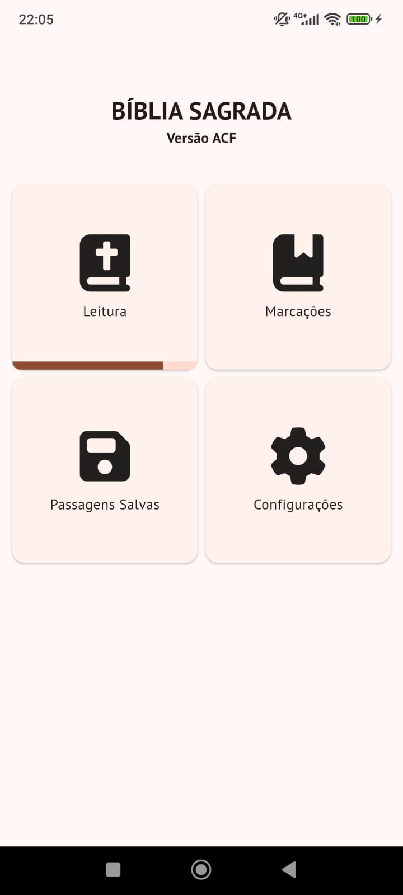
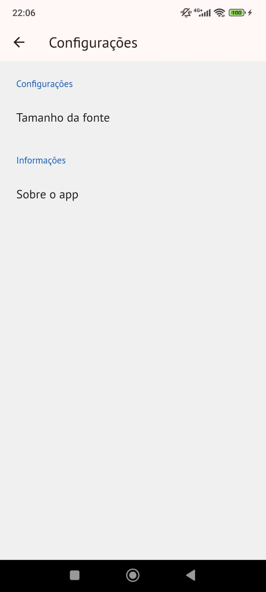
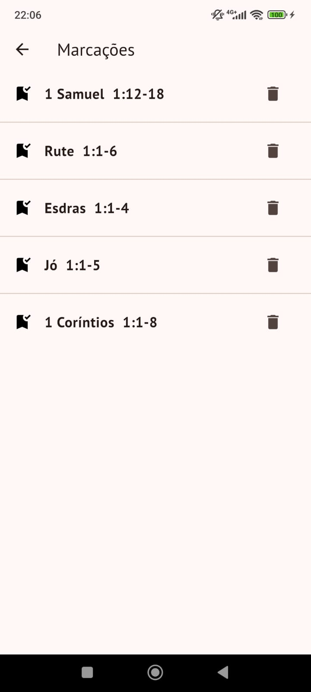
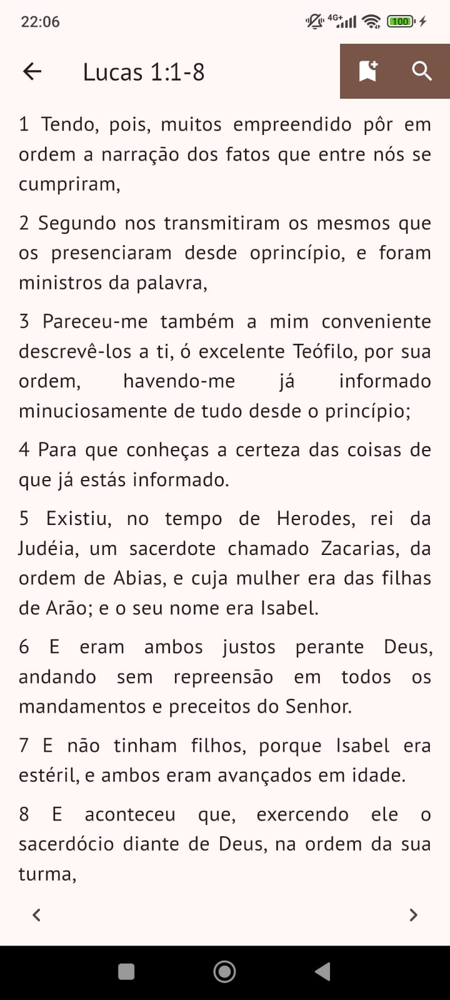
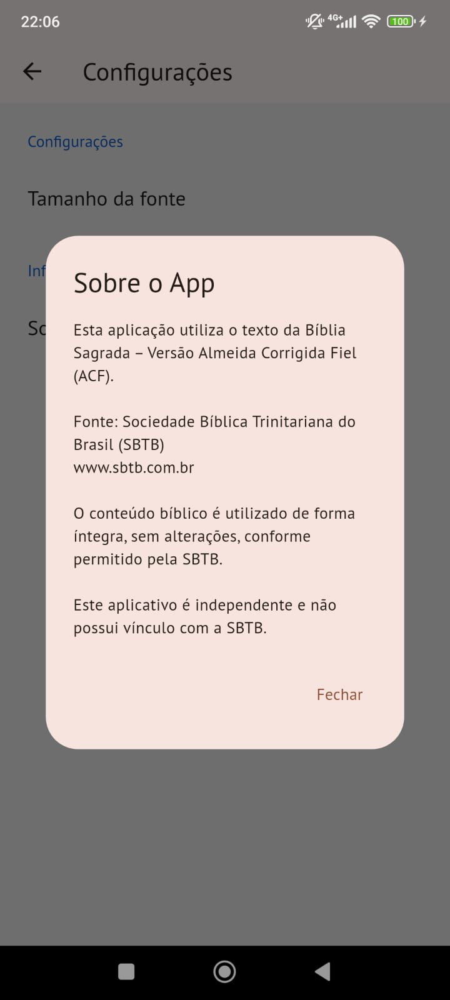
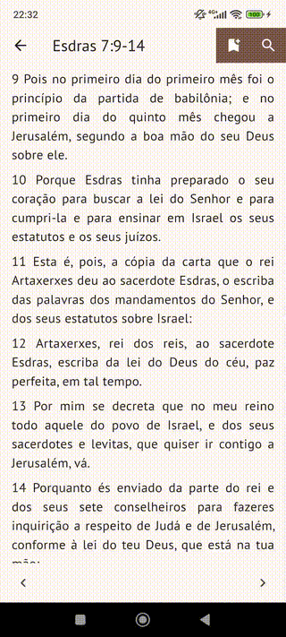

# 📖 Bíblia Sagrada - Flutter App


Aplicativo completo da **Bíblia Sagrada** desenvolvido com **Flutter**, focado em uma experiência de leitura fluida, intuitiva e personalizável, mesmo offline. Ideal para uso pessoal e uma ótima vitrine de conhecimentos em Flutter, gerenciamento de estado com Bloc, persistência local com SQLite, e UI responsiva.

---

## 🧠 Sobre o Projeto

Este projeto foi criado com o objetivo de oferecer uma alternativa moderna e leve para leitura da Bíblia Sagrada. Ele funciona totalmente offline, permite marcações de versículos favoritos, e conta com um sistema de busca ágil por livros, capítulos e versículos. Foi um desafio técnico que envolveu arquitetura com `flutter_bloc`, armazenamento local com `sqflite` e customização de UI com `google_fonts` e `font_awesome_flutter`.

---

## ✨ Funcionalidades

- 📚 Leitura completa da Bíblia (Antigo e Novo Testamento)
- 🔍 Busca instantânea por **livro, capítulo e versículo**
- 🔖 Marcação de páginas (bookmarks)
- ⚙️ Tela de configurações com personalização de tema, fonte e preferências (ainda não implementado)
- 💾 Armazenamento local com SQLite e persistência automática com Hydrated Bloc
- 🌙 Suporte a tema escuro e claro - (ainda não implementado)

---

## ⚙️ Tela de Configurações

A tela de configurações oferece opções para personalizar a leitura:

- 🎨 **Tema do app**: Claro, Escuro ou Automático
- 🔠 **Tamanho da fonte**: Ajustável - (ainda não implementado)
- ✒️ **Fonte personalizada** com integração ao [Google Fonts](https://fonts.google.com/)
- 💾 **Persistência automática** com `shared_preferences` e `hydrated_bloc`

---

## 📸 Capturas de Tela

### 🏠 Tela Principal


### ⚙️ Tela de Configurações


### 🔖 Tela de Marcações


### 📖 Tela de Leitura


### ℹ️ Tela Sobre


---

## 🔍 Demonstração da Busca

A busca é instantânea e permite navegar diretamente até qualquer trecho da Bíblia:



---

## 🛠️ Tecnologias Utilizadas

| Pacote                     | Função                                 |
|---------------------------|----------------------------------------|
| `flutter_bloc`            | Gerenciamento de estado                |
| `hydrated_bloc`           | Persistência automática de estado      |
| `sqflite`                 | Banco de dados local                   |
| `json_serializable`       | Serialização de modelos JSON           |
| `build_runner`            | Geração de código automático           |
| `shared_preferences`      | Preferências do usuário                |
| `google_fonts`            | Fontes personalizadas                  |
| `font_awesome_flutter`    | Ícones estilizados                     |
| `flutter_settings_ui`     | Interface pronta para configurações    |
| `path`, `path_provider`   | Manipulação de arquivos e diretórios   |

---

## 🚧 Desafios Técnicos Superados

- Gerenciar o estado da leitura e preferências entre sessões com `hydrated_bloc`
- Sincronizar o banco de dados local com as marcações feitas pelo usuário
- Criar uma UI responsiva que se adapta bem a diferentes tamanhos de tela
- Otimizar a performance da busca por trechos da Bíblia com navegação direta

---

## ▶️ Como Executar o Projeto

1. Clone o repositório:
   ```bash
   git clone https://github.com/IzacPS/biblia.git
   cd biblia
   ```
1. Instale as dependências:
   ```bash
   flutter pub get
   ```
1. Gere os arquivos de serialização (opcional):
   ```bash
   flutter pub run build_runner build --delete-conflicting-outputs
   ```
1. Rode o app:
   ```bash
   flutter run
   ```

📃 Licença
Este projeto está licenciado sob a MIT License.